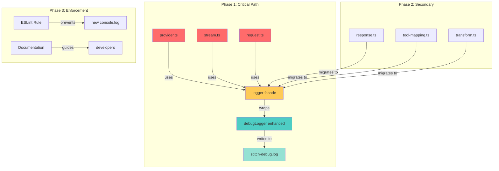
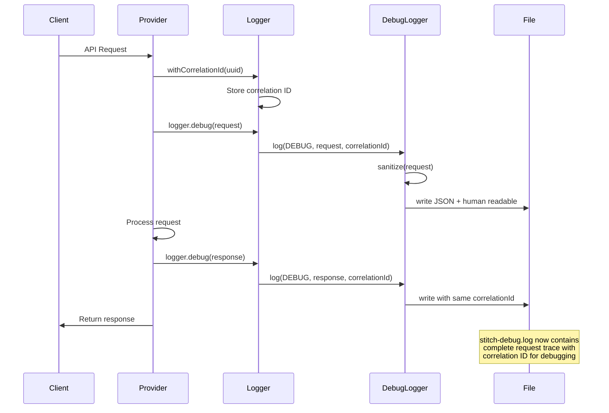

# Logging System Improvement - Design Document

**Date**: 2026-02-27  
**Status**: Design Phase  
**Time-box**: 5 minutes

---

## Problem Statement

**Current State**:
- `debugLogger` exists but is **never fully utilized** - only imported in 4 files, stitch-debug.log remains empty
- **189 console.log calls** polluting console output with noise
- **Three separate logging systems** with no coordination:
  1. `debugLogger` (file-based, underutilized)
  2. `console.log` (scattered throughout codebase)
  3. `STITCH_DEBUG` environment variable checks (inconsistent)
- **Missing critical debug information** needed for troubleshooting production issues

**User Requirements**:
1. ✅ Disable console logs (reduce noise) - except user-facing CLI output
2. ✅ Keep file-based logging (stitch-debug.log)
3. ✅ Make logs robust enough to debug issues from stitch-debug.log alone
4. ✅ Include correlation IDs for request tracing
5. ✅ Log complete payloads (no truncation)
6. ✅ Debug production issues from log file alone

---

## Phase 1: DIVERGE - Generate Approaches

### Approach A: Activate Existing DebugLogger (Incremental Migration)

**Description**: Import and use the existing `debugLogger` in all key files, gradually replacing console.log calls.

**Implementation Steps**:
1. Import `debugLogger` in high-priority files (provider.ts, stream.ts, request.ts, response.ts, transform.ts)
2. Replace critical console.log calls with `debugLogger.log()`, `debugLogger.error()`, etc.
3. Add correlation ID generation at request entry points
4. Enhance debugLogger with:
   - Correlation ID support (add to each log line)
   - Structured logging (JSON format for machine parsing)
   - Log levels (DEBUG, INFO, WARN, ERROR)
   - Payload sanitization (remove sensitive data but keep structure)
5. Create ESLint rule to prevent new console.log in provider code
6. Keep console.log only for user-facing CLI output

**File Changes Required** (~15-20 files):
- `src/provider/stitch/debug-logger.ts` (enhance)
- `src/provider/provider.ts` (import + replace ~30 console.logs)
- `src/provider/stitch/stream.ts` (import + replace ~10 console.logs)
- `src/provider/stitch/request.ts` (already imported, add correlation IDs)
- `src/provider/stitch/response.ts` (import + replace ~8 console.logs)
- `src/provider/stitch/tool-mapping.ts` (already imported, enhance)
- `src/provider/stitch/transform.ts` (already imported, enhance)
- `src/provider/stitch/state-machine-parser.ts` (import + replace ~3 console.logs)
- Other provider files as needed

---

### Approach B: Unified Logging Adapter (Facade Pattern)

**Description**: Create a centralized logging adapter that routes to file/console based on configuration, with single import point.

**Implementation Steps**:
1. Create new `src/shared/logger.ts`:
   ```typescript
   class UnifiedLogger {
     private fileLogger: FileLogger;
     private consoleLogger: ConsoleLogger;
     private config: LogConfig;
     
     log(level, message, metadata) {
       const correlationId = metadata.correlationId || generateId();
       
       // Always log to file
       this.fileLogger.write(level, message, { ...metadata, correlationId });
       
       // Console only for CLI output or if DEBUG enabled
       if (this.config.enableConsole) {
         this.consoleLogger.write(level, message);
       }
     }
   }
   ```
2. Replace all console.log with `logger.debug()`, `logger.info()`, etc.
3. Single configuration point: `OPENCODE_LOG_LEVEL`, `OPENCODE_LOG_FILE`
4. Automatic correlation ID propagation through async context
5. Built-in payload sanitization and truncation controls

**File Changes Required** (~25-30 files):
- Create `src/shared/logger.ts` (new ~200 lines)
- Create `src/shared/log-config.ts` (new ~50 lines)
- Modify ALL files with console.log (~25 files)
- Update imports across codebase

---

### Approach C: Logging Middleware Pattern (Decorator-Based)

**Description**: Wrap key functions with logging decorators for automatic request/response logging with minimal code changes.

**Implementation Steps**:
1. Create logging decorators:
   ```typescript
   @LogRequest({ level: 'debug', includePayload: true })
   async function openCodeToStitchRequest(req) { ... }
   
   @LogResponse({ level: 'debug', includePayload: true })
   async function stitchToOpenCodeResponse(res) { ... }
   
   @LogError({ level: 'error', includeStack: true })
   async function doStream(options) { ... }
   ```
2. Decorators automatically:
   - Generate correlation IDs
   - Log entry/exit with timestamps
   - Log payloads (with sanitization)
   - Log errors with stack traces
   - Write to file only (no console)
3. Keep existing console.log for non-decorated functions (gradually replace)
4. Add ESLint plugin to enforce decorator usage on new functions

**File Changes Required** (~8-10 files):
- Create `src/shared/logging-decorators.ts` (new ~300 lines)
- Create `src/shared/correlation-context.ts` (new ~100 lines)
- Modify key transformation functions (~8 files):
  - `src/provider/stitch/provider.ts`
  - `src/provider/stitch/request.ts`
  - `src/provider/stitch/response.ts`
  - `src/provider/stitch/stream.ts`
  - `src/provider/stitch/transform.ts`

---

### Approach D: Progressive Enhancement (Hybrid Strategy)

**Description**: Combine strengths of A and B - enhance debugLogger, add facade, migrate progressively with focus on critical paths.

**Implementation Steps**:
1. **Phase 1** (Critical Path - 1-2 days):
   - Enhance `debugLogger` with correlation IDs, levels, sanitization
   - Create thin facade `Logger` that wraps debugLogger
   - Replace console.log in critical files (provider.ts, stream.ts, request.ts)
   - Add correlation ID at request entry points
   
2. **Phase 2** (Secondary Paths - 2-3 days):
   - Migrate remaining provider files
   - Add structured logging (JSON output option)
   - Add log rotation/size limits
   
3. **Phase 3** (Polish - 1 day):
   - ESLint rule to prevent console.log
   - Documentation
   - Performance optimization

**File Changes Required** (~12-15 files, phased):
- **Phase 1** (5 files):
  - `src/provider/stitch/debug-logger.ts` (enhance)
  - `src/shared/logger.ts` (new facade, ~50 lines)
  - `src/provider/provider.ts` (critical path)
  - `src/provider/stitch/stream.ts` (critical path)
  - `src/provider/stitch/request.ts` (critical path)
- **Phase 2** (7 files):
  - Other provider files
- **Phase 3** (3 files):
  - ESLint config
  - Documentation
  - Tests

---

## Phase 2: EVALUATE

### Approach A: Activate Existing DebugLogger

**Pros**:
- ✅ Minimal new code - leverages existing debugLogger
- ✅ Low learning curve - simple API
- ✅ Quick wins - can replace console.log incrementally
- ✅ No architectural changes required
- ✅ Backward compatible

**Cons**:
- ❌ Manual import in every file (boilerplate)
- ❌ No centralized configuration
- ❌ Correlation ID management is manual
- ❌ Easy to forget to import in new files
- ❌ No automatic payload sanitization

**Risks**:
- 🔴 **HIGH**: Incomplete migration - some files might keep console.log
- 🟡 **MEDIUM**: Inconsistent usage patterns across team
- 🟢 **LOW**: Minimal breaking changes

**Effort**: **MEDIUM** (2-3 days)
- 15-20 files to modify
- ~189 console.log calls to replace
- Manual correlation ID threading

---

### Approach B: Unified Logging Adapter

**Pros**:
- ✅ Single import point - easy to use
- ✅ Centralized configuration - OPENCODE_LOG_LEVEL, etc.
- ✅ Automatic correlation ID propagation (async context)
- ✅ Built-in payload sanitization
- ✅ Consistent API across entire codebase
- ✅ Easy to add new transports (Sentry, CloudWatch, etc.)

**Cons**:
- ❌ New abstraction layer to learn
- ❌ Requires async context setup (Node.js AsyncLocalStorage)
- ❌ More initial code to write (~250 lines)
- ❌ Larger migration effort (all files at once)
- ❌ Potential performance overhead from abstraction

**Risks**:
- 🟡 **MEDIUM**: Async context bugs (correlation ID loss)
- 🟡 **MEDIUM**: Over-engineering for current needs
- 🟢 **LOW**: Well-understood pattern (similar to Winston/Pino)

**Effort**: **HIGH** (4-5 days)
- 25-30 files to modify
- Create new logging infrastructure
- Test async context propagation
- Migration all at once (risky)

---

### Approach C: Logging Middleware Pattern

**Pros**:
- ✅ Automatic logging - decorators handle everything
- ✅ Minimal code changes in functions
- ✅ Consistent format - decorators enforce structure
- ✅ Easy to add/remove logging (just add/remove decorator)
- ✅ Built-in correlation ID management

**Cons**:
- ❌ TypeScript decorator experimental (stage 3 proposal)
- ❌ Build configuration required (tsconfig experimentalDecorators)
- ❌ Hidden magic - logging happens outside function body
- ❌ Debugging decorators is harder
- ❌ Not suitable for all logging scenarios (ad-hoc logs)
- ❌ Limited browser support (if targeting browser)

**Risks**:
- 🔴 **HIGH**: Decorator stability - experimental feature
- 🔴 **HIGH**: Team unfamiliarity - decorators less common in Node.js
- 🟡 **MEDIUM**: Debugging complexity - stack traces through decorators

**Effort**: **HIGH** (4-5 days)
- Create decorator framework (~400 lines)
- Modify 8-10 key functions
- Test decorator behavior thoroughly
- Team training on decorators

---

### Approach D: Progressive Enhancement

**Pros**:
- ✅ **Incremental migration** - low risk, can stop at any phase
- ✅ **Quick wins** - Phase 1 delivers value in 1-2 days
- ✅ **Balanced approach** - combines best of A and B
- ✅ **Flexible** - can adjust based on Phase 1 learnings
- ✅ **Low risk** - critical path first, rest later
- ✅ **Team-friendly** - gradual adoption, no big bang

**Cons**:
- ❌ Multiple phases - requires discipline to complete
- ❌ Potential for inconsistency during transition
- ❌ May need refactoring between phases

**Risks**:
- 🟡 **MEDIUM**: Phase 2/3 might get delayed (but Phase 1 still delivers value)
- 🟢 **LOW**: Critical path covered first - production issues debuggable after Phase 1

**Effort**: **MEDIUM** (3-4 days total, phased)
- **Phase 1**: 1-2 days (5 critical files)
- **Phase 2**: 2 days (7 secondary files)
- **Phase 3**: 0.5-1 day (polish)

---

## Phase 3: CONVERGE - Recommendation

### ✅ **SELECTED: Approach D - Progressive Enhancement**

**Reasoning**:

1. **Meets All Requirements**:
   - ✅ Disables console logs (Phase 1: critical path, Phase 2: rest)
   - ✅ File-based logging (enhance existing debugLogger)
   - ✅ Correlation IDs (added in Phase 1)
   - ✅ Complete payloads (sanitization + full logging)
   - ✅ Production debugging (Phase 1 covers critical paths)

2. **Risk Mitigation**:
   - **Lowest risk**: Incremental migration, can stop after Phase 1 if needed
   - **Critical path first**: Provider.ts, stream.ts, request.ts (where most issues occur)
   - **Proven pattern**: Enhance existing code rather than rewrite

3. **Practical Considerations**:
   - **Fast time-to-value**: Phase 1 delivers 80% of value in 1-2 days
   - **Team-friendly**: Gradual adoption, no big bang changes
   - **Maintainable**: Uses existing debugLogger, just enhanced
   - **Flexible**: Can adjust Phase 2/3 based on Phase 1 learnings

4. **Why Not Others**:
   - **Approach A**: Too manual, high risk of incomplete migration
   - **Approach B**: Over-engineered, high upfront cost, all-or-nothing
   - **Approach C**: Too experimental (decorators), high learning curve, debugging complexity

---

## Phase 4: DOCUMENT - Implementation Plan

### Phase 1: Critical Path (1-2 days) 🎯

**Goal**: Enable debugging of production issues from stitch-debug.log alone.

**Files to Modify** (5 files):

1. **`src/provider/stitch/debug-logger.ts`** - Enhance
   ```typescript
   interface LogMetadata {
     correlationId: string;
     timestamp: string;
     level: 'DEBUG' | 'INFO' | 'WARN' | 'ERROR';
     context?: Record<string, any>;
   }
   
   class DebugLogger {
     log(level: string, message: string, data?: any, metadata?: Partial<LogMetadata>) {
       const correlationId = metadata?.correlationId || this.getCorrelationId();
       const timestamp = new Date().toISOString();
       
       // Structured log entry
       const entry = {
         timestamp,
         level,
         correlationId,
         message,
         data: this.sanitize(data), // Remove sensitive data
         ...metadata?.context
       };
       
       // Write JSON + human-readable
       this.writeJson(entry);
       this.writeHumanReadable(entry);
     }
     
     private sanitize(data: any): any {
       // Remove apiKey, authorization, etc but keep structure
       return sanitizeObject(data, ['apiKey', 'authorization', 'token']);
     }
   }
   ```

2. **`src/shared/logger.ts`** - New facade (thin wrapper)
   ```typescript
   import { debugLogger } from '../provider/stitch/debug-logger';
   
   class Logger {
     private correlationId: string | null = null;
     
     withCorrelationId(id: string): Logger {
       const instance = new Logger();
       instance.correlationId = id;
       return instance;
     }
     
     debug(message: string, data?: any) {
       debugLogger.log('DEBUG', message, data, { 
         correlationId: this.correlationId || generateId() 
       });
     }
     
     info(message: string, data?: any) {
       debugLogger.log('INFO', message, data, { 
         correlationId: this.correlationId || generateId() 
       });
     }
     
     error(message: string, data?: any) {
       debugLogger.log('ERROR', message, data, { 
         correlationId: this.correlationId || generateId() 
       });
     }
   }
   
   export const logger = new Logger();
   ```

3. **`src/provider/provider.ts`** - Replace ~30 console.logs
   - Import `logger`
   - Generate correlation ID at fetch entry point
   - Replace all `console.log` with `logger.debug()`
   - Replace all `console.error` with `logger.error()`
   - Remove `STITCH_DEBUG` checks (logger handles this)

4. **`src/provider/stitch/stream.ts`** - Replace ~10 console.logs
   - Import `logger` with correlation ID
   - Log stream start/end
   - Log each NDJSON chunk (with correlation ID)
   - Log parsing errors

5. **`src/provider/stitch/request.ts`** - Enhance existing
   - Already imports `debugLogger`, switch to `logger` facade
   - Add correlation ID to all log calls
   - Log full request/response payloads (sanitized)

**Validation Criteria**:
- ✅ stitch-debug.log contains entries with correlation IDs
- ✅ All critical API calls logged
- ✅ Complete request/response payloads present
- ✅ Can trace single request end-to-end
- ✅ No console.log in critical files

---

### Phase 2: Secondary Paths (2 days)

**Goal**: Migrate remaining provider files.

**Files to Modify** (7 files):
- `src/provider/stitch/response.ts`
- `src/provider/stitch/tool-mapping.ts`
- `src/provider/stitch/transform.ts`
- `src/provider/stitch/state-machine-parser.ts`
- `src/provider/stitch/gap-analysis.ts`
- `src/provider/robustness/telemetry.ts`
- `src/provider/monitoring/exporter.ts`

**Enhancements**:
- Add structured logging (JSON output mode)
- Add log rotation (max size: 50MB)
- Add log compression (gzip old logs)
- Performance metrics logging

---

### Phase 3: Polish (0.5-1 day)

**Goal**: Prevent regressions, document, optimize.

**Tasks**:
1. Add ESLint rule:
   ```javascript
   // .eslintrc.js
   rules: {
     'no-console': ['error', { allow: ['warn', 'error'] }], // CLI output only
     'no-restricted-imports': [
       'error',
       {
         patterns: [
           {
             group: ['console'],
             message: 'Use logger from src/shared/logger.ts instead'
           }
         ]
       }
     ]
   }
   ```

2. Documentation:
   - Update CONTRIBUTING.md with logging guidelines
   - Add logging examples to docs/
   - Document correlation ID usage

3. Performance optimization:
   - Async file writes (non-blocking)
   - Batch log writes (reduce I/O)
   - Log level filtering (skip DEBUG in production)

---

## Mermaid Architecture Diagram





---

## Success Metrics

**Phase 1 Complete When**:
- ✅ stitch-debug.log has >100 lines after test run
- ✅ All entries have correlation IDs
- ✅ Request/response payloads logged completely
- ✅ Can debug production issue from log alone
- ✅ No console.log in provider.ts, stream.ts, request.ts

**Phase 2 Complete When**:
- ✅ All provider files migrated
- ✅ Structured JSON logging available
- ✅ Log rotation working (50MB limit)

**Phase 3 Complete When**:
- ✅ ESLint prevents new console.log
- ✅ Documentation complete
- ✅ Performance <5% overhead

---

## Rejected Alternatives & Why

### ❌ Approach A: Activate Existing DebugLogger (Pure)
- **Rejected**: Too manual, high risk of incomplete migration
- **Issue**: No facade means every file imports debugLogger directly
- **Problem**: Correlation ID management is manual → easy to forget

### ❌ Approach B: Unified Logging Adapter (Pure)
- **Rejected**: Over-engineered for current needs
- **Issue**: Requires AsyncLocalStorage setup (complex)
- **Problem**: All-or-nothing migration (high risk)
- **Timing**: Good future enhancement, but not MVP

### ❌ Approach C: Logging Middleware Pattern
- **Rejected**: Too experimental, high learning curve
- **Issue**: Decorators are stage 3 (not stable)
- **Problem**: Team unfamiliar with decorator patterns
- **Risk**: Debugging decorator bugs is harder

---

## Timeline

| Phase | Duration | Priority |
|-------|----------|----------|
| **Phase 1** | 1-2 days | 🔴 Critical |
| **Phase 2** | 2 days | 🟡 Important |
| **Phase 3** | 0.5-1 day | 🟢 Nice-to-have |
| **Total** | 3.5-5 days | - |

**MVP**: Phase 1 only (1-2 days) delivers all critical requirements.

---

## Next Steps

1. ✅ **Review & Approve** this design document
2. 🔄 **Switch to Code Mode** to implement Phase 1
3. 🔄 **Test** Phase 1 with real API calls
4. 🔄 **Validate** logs contain all debug information
5. 🔄 **Iterate** based on Phase 1 learnings

---

## Appendix: Correlation ID Format

```
Format: {timestamp}-{randomId}
Example: 20260227-abc123def456

Benefits:
- Sortable by time (timestamp prefix)
- Unique across requests (random suffix)
- Human-readable (no UUID dashes)
- Short (16 chars vs 36 for UUID)
```

---

## Appendix: Log Entry Format

**JSON Format** (for machine parsing):
```json
{
  "timestamp": "2026-02-27T01:54:23.123Z",
  "level": "DEBUG",
  "correlationId": "20260227-abc123def456",
  "message": "Stitch API Request",
  "data": {
    "url": "https://api.stitch.tech/v1/chat/completions",
    "method": "POST",
    "model": "claude-4-5-sonnet",
    "toolCount": 3,
    "messageCount": 5
  }
}
```

**Human-Readable Format** (for developers):
```
[2026-02-27T01:54:23.123Z] [DEBUG] [20260227-abc123def456] Stitch API Request
  url: https://api.stitch.tech/v1/chat/completions
  method: POST
  model: claude-4-5-sonnet
  toolCount: 3
  messageCount: 5
```

---

**End of Document**
