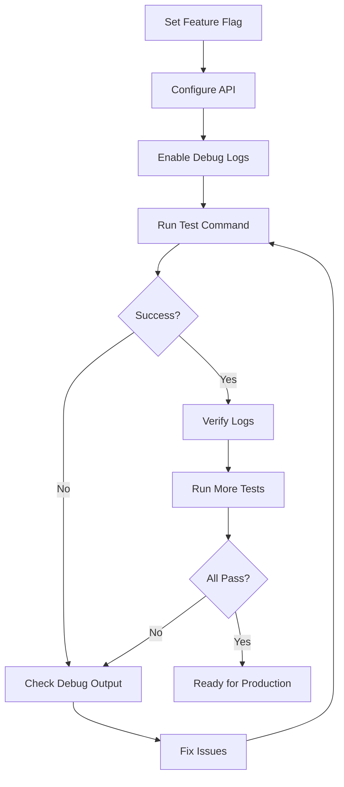

# Native Stitch Provider - Feature Flag Implementation Summary

## Changes Made

### 1. Feature Flag Added ([`flag.ts`](../../flag/flag.ts:58))

```typescript
// Native Stitch Provider (replaces OpenAI SSE spoofing)
export const OPENCODE_USE_NATIVE_STITCH_PROVIDER = truthy("OPENCODE_USE_NATIVE_STITCH_PROVIDER")
```

**Default Value:** `false` (disabled)

### 2. Conditional Provider Registration ([`provider.ts`](../provider.ts:130-155))

```typescript
import { Flag } from "../flag/flag"

const BUNDLED_PROVIDERS: Record<string, (options: any) => SDK> = {
  // ... other providers
  // Native Stitch provider (enabled via OPENCODE_USE_NATIVE_STITCH_PROVIDER=true)
  ...(Flag.OPENCODE_USE_NATIVE_STITCH_PROVIDER ? { "@opencode/stitch": createStitch } : {}),
}
```

**Behavior:**
- When `OPENCODE_USE_NATIVE_STITCH_PROVIDER=true`: Native provider is registered
- When `OPENCODE_USE_NATIVE_STITCH_PROVIDER=false` or unset: Falls back to legacy implementation

### 3. Enhanced Debug Logging ([`provider.ts`](./provider.ts:145-155))

```typescript
constructor(modelId: StitchModelId, config: StitchConfig) {
  this.modelId = modelId;
  this.config = config;
  
  if (process.env.STITCH_DEBUG === 'true') {
    console.log('[Stitch Provider] Initialized native provider', {
      modelId,
      baseURL: config.baseURL || DEFAULT_BASE_URL,
      hasApiKey: !!config.apiKey
    });
  }
}
```

Additional logging added for:
- Provider initialization
- Tool injection
- Tool call emission
- Stream completion

### 4. Comprehensive Documentation

Created three documentation files:

**[`QUICK_START.md`](./QUICK_START.md)** (95 lines)
- Quick reference for developers
- Test commands and expected behavior
- Success indicators and rollback instructions

**[`TESTING.md`](./TESTING.md)** (234 lines)
- Detailed testing procedures
- Debugging failed tests guide
- Success criteria checklist
- Comparison with legacy implementation

**[`NATIVE_PROVIDER_README.md`](./NATIVE_PROVIDER_README.md)** (306 lines)
- Complete architecture overview
- Feature flag system documentation
- Implementation details
- Migration path and troubleshooting

## How to Use

### Enable Native Provider

```bash
# Required: Enable the feature flag
export OPENCODE_USE_NATIVE_STITCH_PROVIDER=true

# Required: Configure Stitch API
export STITCH_API_URL="https://your-stitch-backend.com/v1/chat/completions"
export STITCH_API_KEY="your-api-key"

# Optional: Enable debug logging
export STITCH_DEBUG=true
```

### Test Commands

```bash
# Simple text generation
bun run --cwd packages/opencode dev run "What is 2+2?"

# Tool execution
bun run --cwd packages/opencode dev run "Read package.json and tell me the version"

# Multiple tools
bun run --cwd packages/opencode dev run "Read package.json then list files in src/"
```

### Disable (Rollback)

```bash
export OPENCODE_USE_NATIVE_STITCH_PROVIDER=false
# or simply
unset OPENCODE_USE_NATIVE_STITCH_PROVIDER
```

## Implementation Status

| Component | Status | Notes |
|-----------|--------|-------|
| Native Provider | ✅ Complete | Full AI SDK v2 implementation |
| Tool Injection | ✅ Complete | Prompt-based schema injection |
| JsonToolParser | ✅ Complete | Robust tool call extraction |
| Feature Flag | ✅ Implemented | Safe enable/disable mechanism |
| Debug Logging | ✅ Implemented | Comprehensive tracking |
| Documentation | ✅ Complete | 3 guides covering all aspects |
| Testing | ⏳ Ready | Awaiting execution |
| Production | ❌ Disabled | Feature flag off by default |

## Safety Measures

1. **Disabled by Default:** New implementation must be explicitly enabled
2. **Clean Rollback:** Simple environment variable change, no code deployment needed
3. **Fallback Logic:** System automatically uses legacy implementation when disabled
4. **Debug Logging:** Comprehensive tracking for issue diagnosis
5. **Documentation:** Clear testing procedures and troubleshooting guides

## Benefits of Feature Flag Approach

✅ **Safe Deployment:**
- No risk to existing users
- Easy to enable for testing
- Instant rollback if issues arise

✅ **Gradual Migration:**
- Test with internal team first
- Expand to beta users
- Full rollout when confident

✅ **Easy Debugging:**
- Can enable for specific debugging sessions
- Clear indication which implementation is active
- Debug logs show exact behavior

✅ **No Code Changes for Rollback:**
- Environment variable only
- No redeployment needed
- Fast response to issues

## Testing Workflow



## Next Steps

1. **Internal Testing:** Enable flag for development team
2. **Collect Metrics:** Track success rate, performance, error patterns
3. **Beta Testing:** Expand to trusted users
4. **Monitor Production:** Watch error rates and user feedback
5. **Full Rollout:** Enable by default when confident
6. **Deprecate Legacy:** Remove old implementation after stable period

## Files Modified

- [`src/flag/flag.ts`](../../flag/flag.ts) - Added feature flag
- [`src/provider/provider.ts`](../provider.ts) - Conditional registration
- [`src/provider/stitch/provider.ts`](./provider.ts) - Debug logging

## Files Created

- [`src/provider/stitch/QUICK_START.md`](./QUICK_START.md) - Quick reference
- [`src/provider/stitch/TESTING.md`](./TESTING.md) - Testing guide
- [`src/provider/stitch/NATIVE_PROVIDER_README.md`](./NATIVE_PROVIDER_README.md) - Full documentation
- [`src/provider/stitch/FEATURE_FLAG_IMPLEMENTATION.md`](./FEATURE_FLAG_IMPLEMENTATION.md) - This file

## Support

For questions or issues during testing:
1. Check [`QUICK_START.md`](./QUICK_START.md) for quick reference
2. Review [`TESTING.md`](./TESTING.md) for detailed procedures
3. Consult [`NATIVE_PROVIDER_README.md`](./NATIVE_PROVIDER_README.md) for architecture
4. Enable `STITCH_DEBUG=true` for detailed logs

## Conclusion

The native Stitch provider is **fully implemented** and **protected by a feature flag**. It's ready for testing but disabled by default for safety. The implementation can be enabled/disabled via a simple environment variable without code changes, allowing for safe evaluation and instant rollback if needed.
